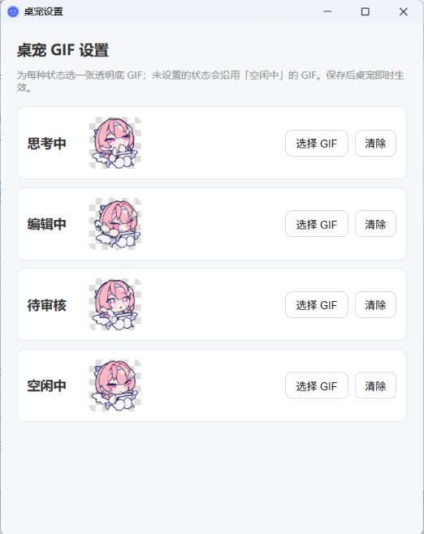

# dsh-pet

DSH（DeepSeek Harness）桌宠插件：在 DSH 界面中以浮层形式显示一只桌宠，根据当前会话状态自动切换对应 GIF。兼容 Web UI 与桌面版。

## 功能

- **状态跟随**：实时检测 DSH 会话状态，自动切换对应状态的 GIF（见「状态与 GIF 对应表」）
- **互动**：单击或双击触发摸头与爱心动画；拖动可调整位置；右键打开设置
- **位置锚定**：位置以「距窗口右下角的偏移量」保存，窗口缩放、最大化及重启后均保持对右下角的相对位置
- **审批提醒**：出现待审批、待回答提问或计划评审时弹跳提醒，可选提示音
- **自定义 GIF**：各状态可分别上传自定义 GIF（建议使用透明底）
- **降级显示**：GIF 加载失败时显示按状态着色的占位动画，保证桌宠不消失

## 状态与 GIF 对应表

| 优先级 | 设置面板标签 | 默认 GIF | 触发场景 |
|---|---|---|---|
| 1（最高） | 待审核 | approval.gif | 弹出工具审批、AI 提问、计划评审 |
| 2 | 编辑中 | answering.gif | AI 正在产出：流式输出文本，或执行工具调用（写文件、编辑代码、运行命令等） |
| 3 | 思考中 | thinking.gif | 会话运行中但暂无产出：等待首个 token、深度思考（reasoning）流式、工具步骤间隙、模型重试 |
| 4 | 空闲中 | idle.gif | 会话未运行或回合已结束 |

典型一轮对话的状态切换顺序：

```
发送消息 → 思考中（等待首 token / 深度思考）→ 编辑中（输出文本、执行工具）
        →（出现审批）待审核 → 审批完成后回到编辑中 → 回合结束 → 空闲中
```

已知盲区（此期间显示为空闲中）：切换到 Trajectory 标签页时、后台自动压缩（compaction）期间——这两类场景 DSH 前端不提供可供检测的运行标记。

## 安装

### 方式一：GitHub 地址（推荐）

在 DSH 设置 → 插件 → 添加插件中输入：

```
github:Shinarin/dsh-pet
```

或使用命令行：

```bash
dsh plugin --profile desktop add github:Shinarin/dsh-pet
```

### 方式二：本地路径

```bash
dsh plugin --profile desktop add <本仓库的绝对路径>
```

注意：安装或更新后需**完全退出并重启 DSH**，插件方可生效。

> **切换安装来源前请先彻底卸载**：若本机曾以本地路径（`link:`）方式安装过 dsh-pet，直接改装 GitHub 版本会触发 DSH 内置 pnpm 在 Windows 上的 junction 处理缺陷——替换过程会穿透目录联接并长时间挂起，导致安装失败。正确做法：先在设置 → 插件中卸载旧版本并重启 DSH，确认无残留后再安装新来源版本。

### 卸载

在 DSH 设置 → 插件中找到 dsh-pet，执行卸载即可。

## 使用方式

| 操作 | 效果 |
|---|---|
| 拖动 | 移动桌宠；释放后位置自动保存，窗口缩放与重启后仍锚定右下角 |
| 单击 | 摸头并飘出爱心 |
| 双击 | 触发「双击动作」设置项所选动作（当前可选：摸头冒爱心） |
| 右键 | 打开桌宠设置 |

首次使用时，桌宠默认显示在窗口右下角往左 100 像素、往上 200 像素处；拖动后记住新位置。

桌宠右上角设有状态指示点：绿色表示空闲中，橙色表示思考中，蓝色表示编辑中，红色表示待审核。

## 设置

DSH 设置面板 → 桌宠设置：



| 选项 | 说明 | 默认值 |
|---|---|---|
| 显示 | 显示或隐藏桌宠 | 显示 |
| 大小 | 50% – 250% | 100% |
| 双击 | 双击时触发的动作 | 摸头冒爱心 |
| 审批提醒：弹跳 | 出现待审批、提问或评审时弹跳 | 开启 |
| 审批提醒：提示音 | 审批时播放提示音 | 关闭 |
| 完成提醒：弹跳 / 提示音 | 当前版本尚未接入触发逻辑（已知问题，设置项保留） | 开启 / 开启 |
| 各状态 GIF | 为四种状态分别上传自定义 GIF，可通过「清除」恢复默认 | 内置默认 |

### 自定义 GIF 说明

- 推荐使用透明底 GIF，与界面融合更自然
- 自定义 GIF 以 base64 形式保存在本机 localStorage 中，不会上传至任何服务器
- 建议单张 GIF 控制在 1MB 以内，避免影响切换流畅度
- 点击「清除」可恢复对应状态的内置默认 GIF

## 常见问题

**问：重启 DSH 后桌宠不显示？**

答：该问题已在最新版本修复（旧版本将位置保存为绝对像素坐标，窗口尺寸变化后桌宠可能位于可视区域之外）。如仍未显示，请在「桌宠设置」中切换一次显示开关，或拖动窗口边缘触发重新布局。

**问：状态切换与实际不符？**

答：DSH 桌面版采用 nightly 更新通道，前端 DOM 结构可能随版本变化。请打开 DSH 开发者工具控制台并过滤 `[DSH-PET]` 日志（其中包含每次状态切换的判定依据），将日志与场景描述一并提交至 [Issues](https://github.com/Shinarin/dsh-pet/issues)。

**问：为什么 AI 深度思考时显示「思考中」而非「编辑中」？**

答：这是产品规则的划分：reasoning（深度思考）流式归入「思考中」，仅文本输出与工具执行归入「编辑中」。

**问：桌宠显示为彩色占位动画而非 GIF？**

答：此为降级占位符，表示 GIF 加载失败（通常为插件服务端尚未就绪）。请稍候或重启 DSH；若问题持续存在，请至 Issues 反馈。

## 工作原理

- **客户端**（`client.js`）：通过 `MutationObserver` 与 500ms 轮询读取 DSH 前端 DOM 的稳定契约（`data-*` 属性与 `aria-label`，不依赖 CSS 类名或按钮文案），推断当前状态并切换浮层 GIF
- **服务端**（`lib/index.js`）：注册 `/pet/default-gif/:state`（内置 GIF 静态服务）与 `/pet/config`（配置持久化）HTTP 路由
- 状态检测的完整契约及 DSH 源码出处详见 [`spec/state-detection.md`](spec/state-detection.md)

## 文件结构

```
dsh-pet/
  package.json          # 插件元数据
  cordis.patch.yml      # Cordis 层配置
  lib/
    index.js            # 服务端入口（GIF 静态服务与配置持久化路由）
  client.js             # 客户端入口（浮层 UI、状态检测、设置面板）
  default-gifs/         # 内置默认 GIF（idle / thinking / answering / approval）
  docs/                 # 文档配图
  spec/                 # 行为规格（状态检测、位置锚定）
  development.md        # 开发者文档
  devlog.md             # 开发日志
  debug.md              # 坑点记录
```

## 开发

开发者请先阅读 [`development.md`](development.md)。修改任何行为前，请先更新 `spec/` 目录下对应的规格文档。

## License

MIT
